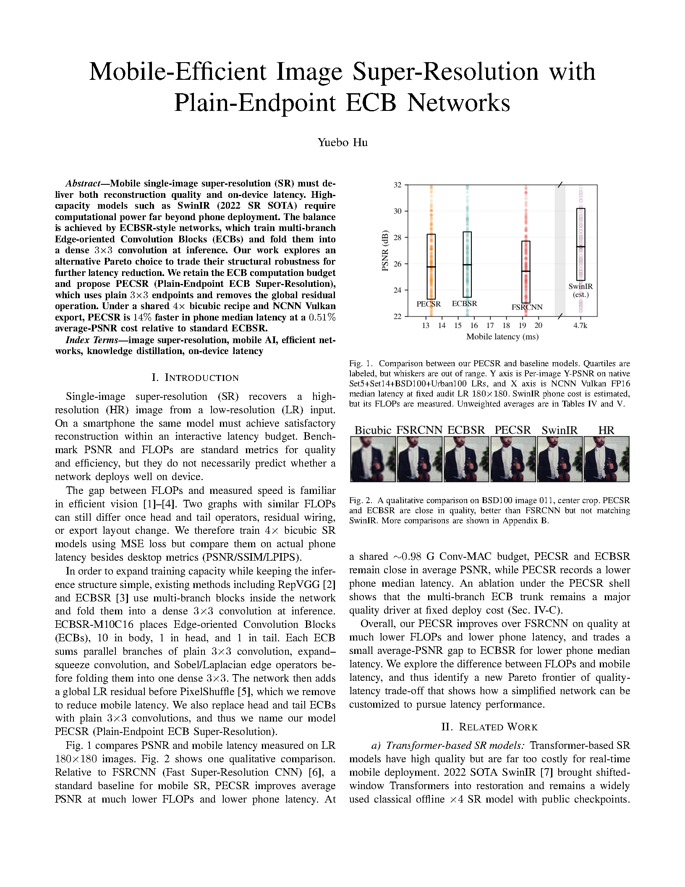

# PECSR — Mobile-Efficient 4× Super-Resolution

**Look first:** [`overview/preview.md`](overview/preview.md) — slide + report page images (GitHub-friendly), plus [`overview.pptx`](overview/overview.pptx) and [`report.pdf`](overview/report.pdf).

PECSR (Plain-Endpoint ECB Super-Resolution) keeps ECBSR’s fused compute budget, uses plain 3×3 endpoints, and drops the global residual. On-device (NCNN Vulkan FP16, LR 180×180): **~14% faster** phone median latency vs ECBSR at a **~0.51%** average-PSNR cost.




## Quick start

```bash
pip install -r requirements.txt
python scripts/check_env.py
```

Eval / train / phone deploy: `configs/README.md`, `deploy/DEPLOY.md`.  
Class demo (adb + NCNN, no APK): `deploy/demo/README.md`.

## Layout

```
overview/     Slides + report (PNG previews + pptx/pdf)
src/          Models (PECSR / ECBSR / FSRCNN, …)
configs/exp/  Locked training recipes
scripts/      Train / eval / export / demo
deploy/       NCNN / phone bench / class demo
results/      Small metrics JSON (checkpoints gitignored)
```

Data (`DIV2K`, benchmarks) and `.pt` checkpoints stay local.
