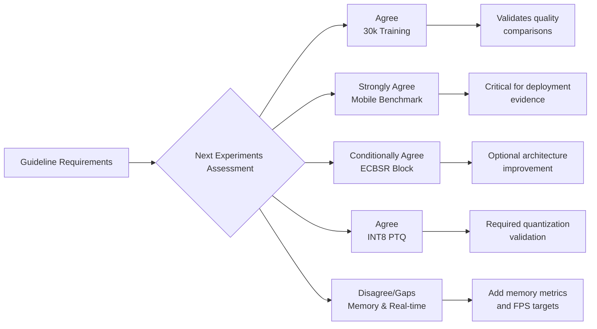

## 📊 Overall Assessment
The proposed next steps are **well-aligned with the guideline's core mandate** to prioritize on-device efficiency over desktop GPU optimization. They correctly emphasize that deployment validation must occur on actual mobile hardware, as the report demonstrates that FLOPs do not reliably predict inference latency on different backends. However, there are **specific gaps relative to the guideline's evaluation criteria**, particularly regarding memory usage and real-time performance assessment, which should be addressed to fully comply with the project requirements.
Below is a structured analysis of agreements and disagreements with each proposed experiment, grounded in the guideline and the report's findings.

## 🔍 Detailed Analysis by Experiment
### 1. 30k Training Continuation — **Agree**
**Justification from Report:** The report explicitly states that "both Base and Plus reach their best checkpoint at the **final training epoch (epoch 607)**, indicating neither model has converged — the 20k budget is a floor, not a ceiling." Extending training to 30k is necessary to ensure that architecture comparisons are not confounded by incomplete optimization.
**Alignment with Guideline:** The guideline requires achieving a "good trade-off between restoration quality and on-device efficiency." Incomplete training could unfairly penalize more complex architectures (like Plus) that may have more headroom. However, the training cost itself is not a deployment concern; this experiment is about **validating the quality side of the trade-off**.
**Recommendation:** Implement as proposed. The honest labeling ("20k training + ~10k low-LR fine-tuning") is appropriate. The stability table comparing 20k vs 30k results will strengthen the credibility of the architecture comparison.
### 2. Real Mobile Benchmark — **Strongly Agree**
**Justification from Report:** The report acknowledges "RTX 4060 is a deployment **proxy** — on-device mobile inference (NPU, INT8) is not measured." The guideline explicitly requires "mobile inference speed" as an evaluation metric. This is the **most critical next step** for compliance.
**Alignment with Guideline:** The guideline states the project should design a "lightweight model that achieves a good trade-off between restoration quality and **on-device efficiency**." The report's finding that "FLOPs and measured latency do **not** rank models identically" on RTX 4060 underscores the necessity of testing on actual mobile hardware.
**Recommendation:** 
- Proceed with one device (Snapdragon 8s Gen 3) and one runtime (NCNN Vulkan FP16 as primary).
- **Critical addition:** Measure **peak memory usage** during inference, as the guideline lists "memory usage" as an evaluation metric. This is particularly important for mobile deployment where memory is constrained.
- Report **frames per second (FPS)** in addition to latency, as the guideline mentions "real-time enhancement" as an application. This contextualizes whether the models meet practical real-time thresholds (e.g., ≥30 FPS for video processing).
### 3. ECBSR Block Variant — **Conditionally Agree**
**Justification from Guideline:** The guideline lists "lightweight convolution blocks" and "mobile-friendly network design" as improvement methods. ECBSR (Edge-oriented Convolution Block for SR) represents a specific instance of this.
**Alignment with Report:** The report successfully demonstrates that depthwise-separable convolutions are effective. However, the latency analysis reveals that "depthwise-separable convolutions are memory-bandwidth bound rather than compute bound on the RTX 4060 tensor cores." Testing a reparameterizable block like ECBSR could address this backend-specific inefficiency.
**Condition:** This should remain **optional and strictly secondary** to Experiments 1-2. The scope guard (replacing one block type in Plus only) is appropriate. Do not let this evolve into a separate model family or distract from the core deployment validation.
### 4. INT8 Post-Training Quantization — **Agree**
**Justification from Guideline:** The guideline explicitly lists "quantization" as an efficiency improvement technique. The report mentions INT8 as a "stretch goal" but does not complete it.
**Alignment with Report:** The report's discussion of FP16 asymmetry (helping MobileSRNet but hurting FSRCNN) suggests that lower precision quantization may have non-obvious effects. Testing INT8 through the **same mobile backend** as Experiment 2 (not just PyTorch dynamic quantization) is essential for deployment claims.
**Recommendation:** 
- Quantize **one finalist** (likely Plus or ECB-Plus if Experiment 3 is completed).
- Report **PSNR drop vs latency gain** compared to FP16.
- If PTQ fails badly, document this as a valid deployment finding — the guideline values understanding efficiency trade-offs, not just positive results.
## ⚠️ Points of Disagreement or Gaps
### Gap 1: Missing Memory Usage Measurement
**Guideline Requirement:** The evaluation section lists "memory usage" as a required metric.
**Current Plan:** The mobile benchmark protocol mentions only latency and precision.
**Recommendation:** Add **peak memory allocation** during inference to the mobile benchmark protocol. This is critical for mobile devices with limited RAM.
### Gap 2: Real-Time Performance Assessment
**Guideline Implication:** The guideline mentions "real-time enhancement" as a key application.
**Current Plan:** The protocol reports median and p90 latency but does not frame it in real-time terms.
**Recommendation:** Explicitly calculate and report **FPS** for each model/input resolution combination. State whether models achieve real-time thresholds (e.g., 30 FPS for video, 60 FPS for interactive applications).
### Gap 3: Model Pruning Not Addressed
**Guideline Suggestion:** The guideline lists "model pruning" as an efficiency technique.
**Current Plan:** Pruning is not mentioned in the next steps.
**Assessment:** Given the models are already extremely small (67K parameters), pruning may yield minimal benefits. However, the final report should **explicitly acknowledge this omission** and briefly justify it (e.g., "pruning was not pursued as the parameter count is already minimal for the target mobile deployment").
### Gap 4: Knowledge Distillation Omission
**Guideline Suggestion:** The guideline lists "knowledge distillation" as an improvement method.
**Current Plan:** KD is deprioritized based on the report's negative results.
**Assessment:** This is **scientifically justified** by the report's systematic gate-then-probe approach showing gradient redundancy (cosine 0.924 for pixel KD) and capacity gaps. However, the final report should **explicitly document** that KD was explored and found ineffective, rather than simply omitting it. This maintains transparency about the exploration process.
## 📋 Summary of Recommendations
| Aspect | Current Plan | Recommendation | Priority |
|--------|--------------|----------------|----------|
| 30k training | Continue all three models | ✅ Implement as proposed | High |
| Mobile benchmark | One device, one runtime | ✅ Add **memory measurement** and **FPS reporting** | Critical |
| ECBSR block | Optional variant | ✅ Keep optional, strictly secondary | Low |
| INT8 PTQ | Optional after mobile export | ✅ Implement as proposed | Medium |
| Memory usage | Not measured | ❌ **Add to mobile protocol** | Critical |
| Real-time assessment | Latency only | ❌ **Add FPS calculation** | High |
| Pruning | Not addressed | ℹ️ Explicitly acknowledge omission in report | Low |
| KD documentation | Deprioritized | ℹ️ Document exploration and negative results | Medium |
## 🎯 Conclusion
The proposed next steps correctly prioritize **deployment validation** over additional training tricks, which aligns with the guideline's emphasis on on-device efficiency. The most critical experiment is the **real mobile benchmark**, as it directly addresses the guideline's core requirement and the report's identified limitation. However, to fully comply with the guideline's evaluation criteria, the mobile benchmark protocol **must include memory usage measurement and real-time FPS assessment**. The optional experiments (ECBSR, INT8) are aligned with the guideline's suggested improvement methods but should remain secondary to the core deployment validation.
