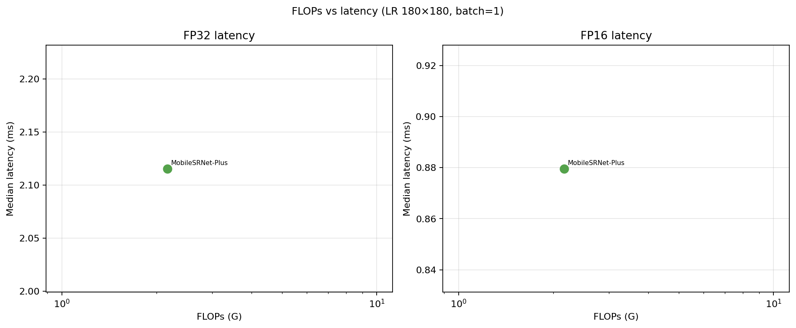

# Final Project Report

## Objective

Mobile-efficient 4× super-resolution under a deployment-oriented efficiency study: custom lightweight architecture with capacity scaling, offline SwinIR teacher distillation (tested and rejected), and backend-aware benchmarking.

## Locked Assumptions

- Training can be expensive; only the student is deployed at inference time.
- SwinIR is an offline teacher, not part of the deployment graph.
- Efficiency claims use mobile-proxy metrics (params, FLOPs, latency), not phone hardware.
- Per-dataset PSNR/SSIM is primary evidence; the average column is an unweighted mean over benchmark datasets (Set5, Set14, BSD100, Urban100), not over images.

---

## Results I — Architecture (RQ1)

**Question:** Can a lightweight LR-space CNN with depthwise-separable blocks and PixelShuffle improve the quality–compute trade-off over FSRCNN?

**Answer: Yes.** Under the fair-budget protocol (MSE loss, batch 24, AMP, 20k updates, identical data/seed), **MobileSRNet-Plus** (64 channels, 8 blocks) achieves the best quality; **MobileSRNet-Base** (40 channels, 6 blocks) offers a stronger efficiency point at ~3.4× lower FLOPs than Plus and ~7.6× lower than FSRCNN.

### Main comparison table (fair-budget 20k)

| Model | Avg PSNR ↑ | Avg SSIM ↑ | Avg LPIPS ↓ | Params | FLOPs (G) |
|---|---:|---:|---:|---:|---:|
| FSRCNN | 26.820 | 0.7441 | 0.1738 | 24,683 | 7.408 |
| MobileSRNet-Base | 27.159 | 0.7559 | 0.1642 | 30,208 | 0.976 |
| **MobileSRNet-Plus** | **27.331** | **0.7615** | **0.1565** | 66,864 | 2.163 |
| SwinIR (teacher) | 29.126 | 0.8140 | 0.1080 | 11,900,199 | 417.797 |

Δ(Plus − FSRCNN): **+0.51 dB** avg PSNR, **−0.017** avg LPIPS, at **~3.4×** lower FLOPs.  
Δ(Plus − Base): **+0.17 dB** avg PSNR, **−0.008** avg LPIPS, at **2.2×** FLOPs.

**Headline deployment model:** MobileSRNet-Plus for best quality; MobileSRNet-Base when FLOPs budget is tightest.

> **Note:** Fair-budget architecture runs use MSE (`mobile_srnet_20k`, `mobile_srnet_plus_20k`). KD runs use Charbonnier (`mobile_srnet_kd*_20k`). Earlier baseline-era tables are superseded by `results/exp_runs/fair_budget_runs.json`.

### Per-dataset PSNR (dB), fair-budget 20k

| Model | Set5 | Set14 | BSD100 | Urban100 |
|---|---:|---:|---:|---:|
| FSRCNN | 29.78 | 26.99 | 26.60 | 23.92 |
| MobileSRNet-Base | 30.24 | 27.37 | 26.79 | 24.24 |
| MobileSRNet-Plus | **30.49** | **27.53** | **26.88** | **24.42** |

### Capacity scaling (Stage B → 20k)

A 2k-update Stage B probe showed Plus ahead of Base (+0.065 dB val PSNR). The full 20k run confirmed the gain on both validation (+0.137 dB) and test benchmarks (+0.172 dB avg PSNR). See `results/training_analysis/` for learning curves.

---

## Results II — Distillation (RQ2)

**Question:** Does offline SwinIR distillation improve the student without adding inference cost?

**Answer: No.** We tested output-level pixel Charbonnier KD (λ-sweep null, gradient cosine 0.877 with GT), then VGG-feature KD (passed pre-training gradient gates but failed a 2k Stage B probe, Δ=−0.003 dB). SwinIR remains ~2 dB ahead on benchmarks; distillation did not transfer that gap to this student. **Capacity scaling (Plus) delivered the only confirmed quality gain.** Full evidence: `lambda_sweep_summary.json`, `kd_diagnostic.json`, `kd_method_gates.json`, `results/training_analysis/06_vgg3_stage_b_2k.png`.

| Test | Result |
|---|---|
| Pixel KD λ=0 vs 0.2 @ 20k | −0.012 dB avg PSNR |
| Pixel KD λ-sweep (5 points @ 10k) | 0.011 dB spread |
| VGG relu3 KD @ 2k (Stage B) | −0.003 dB val PSNR |
| Capacity Plus @ 20k | **+0.172 dB** avg PSNR vs Base |

Do not use baseline-era per-image KD deltas (`results/kd_analysis/`) — confounded by loss, batch size, and AMP.

---

## Results III — Precision and Backend (RQ3)

Audited batch-1 latency on **fair-budget 20k checkpoints** (CUDA Events, warmup 100, timed 500):

**LR 180×180** (`latency_audit/latency_audit.json`):

| Model | FP32 median (ms) | FP16 median (ms) |
|---|---:|---:|
| FSRCNN | 0.97 | 1.35 |
| FSRCNN-Small | 0.75 | 1.09 |
| MobileSRNet-Base | 1.20 | **0.58** |
| MobileSRNet-Plus | 2.12 | **0.88** |
| SwinIR | 560.79 | — |

**LR 320×180 (720p HR)** (`latency_audit/latency_audit_320x180.json`): same ranking; Plus FP16 remains below FSRCNN FP16.

> FLOPs and latency diverge: Plus has 2.2× Base FLOPs but similar FP16 latency to FSRCNN at lower arithmetic cost overall. FP16 does not uniformly beat FP32 on this GPU. See `latency_audit/flops_vs_latency.png` for the full scatter.

### Qualitative comparison

Four zoomed crops in `results/qualitative/` (Urban100, Set14×2, BSD100):

`Bicubic | FSRCNN | MobileSRNet-Base | MobileSRNet-Plus | SwinIR | HR`

Fair-budget 20k checkpoints; no KD column (baseline-era confound).

---

## Experiment Status

| Component | Status |
|---|---|
| Fair-budget 8-run retraining (10k + 20k) | **Done** — `fair_budget_runs.json` |
| MobileSRNet-Plus 20k + benchmarks | **Done** — `mobile_srnet_plus_20k/` |
| KD λ-sweep + diagnostics | **Done** — null |
| KD / VGG pre-training gates + Stage B | **Done** — null |
| Capacity Stage B (Plus @ 2k) | **Done** — passed |
| Latency audit | **Done** — `latency_audit/` |
| Training analysis figures | **Done** — `training_analysis/` |
| Qualitative panels | **Done** — `results/qualitative/` (4 crops) |
| FLOPs vs latency scatter (RQ3) | **Done** — `latency_audit/flops_vs_latency.png` |
| Latency audit 320×180 (720p HR) | **Done** — `latency_audit/latency_audit_320x180.json` |

---

## Limitations

- Classical bicubic 4× SR only; real mobile degradations (noise, blur, compression, ISP) not modeled.
- RTX 4060 CUDA is a deployment proxy, not mobile hardware.
- Average PSNR is an unweighted mean over benchmark datasets.
- SwinIR quality gap remains large (~1.8 dB avg PSNR vs Plus); KD did not close it (pixel or VGG-feature).
- Base, Plus, and FSRCNN best checkpoints are at epoch 607 — 20k updates may still be under-budget.
- Depthwise-separable convolution efficiency is backend-dependent.

---

## Summary Narrative

> We design MobileSRNet — an LR-space CNN with depthwise-separable residual blocks and PixelShuffle upsampling — and show under fair training that it outperforms FSRCNN on standard benchmarks at substantially lower FLOPs. Capacity scaling to MobileSRNet-Plus (64ch, 8 blocks) adds a further +0.17 dB avg PSNR over Base while remaining ~3.4× below FSRCNN in arithmetic cost, with competitive FP16 latency (Plus 0.88 ms vs FSRCNN 1.35 ms @ LR 180×180). Offline SwinIR distillation was tested rigorously — pixel-output KD is gradient-redundant with HR supervision; VGG-feature KD passed pre-training gates but failed a short Stage B probe — and did not improve the student. The confirmed path to higher quality is architecture capacity, not KD. Finally, audited latency and FLOPs–latency scatter plots show that arithmetic savings do not uniformly translate to measured speed; precision mode and backend support jointly determine deployment efficiency.

**Reference:** `results/training_analysis/training_analysis.md`  
**Experiment log:** `progress.md`
